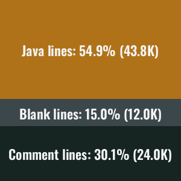

## What is Cyder

Funny you should ask this question, I'm asked it quite a lot and usually fail to give a comprehensive and elegant
answer. The best I can do is something along the lines of "Cyder is a multi-purpose, desktop manager, GUI tool." It is
written using a custom Swing UI library which was built on top of lightweight Swing components. No modern GUI
dependencies such as [FlatLaf](https://github.com/JFormDesigner/FlatLaf), [MaterialFX](https://github.com/palexdev/MaterialFX)
or [FXML](https://openjfx.io/) were used, thus all Cyder components are closely related to [java/awt/Component.java](https://developer.classpath.org/doc/java/awt/Component-source.html).

Some examples of what you can do with Cyder include:

* Downloading Audio from a YouTube video, playlist, uuid, or link
* Image transforms, markup, and painting
* Evaluating mathematical expressions as simple as 2 * 2 or as complex as sin(e^pi*cos(64^cos(e^-1)))
* Visualizing algorithms such as A*, Graham Scan, Game of Life
* Converting audio files between formats such as wav and mp3
* Playing local audio files with the ability to "dreamify"
* Hashing inputs with a nice hashing widget using algorithms such as MD5, SHA1, and SHA256
* Reading, writing, and storing notes
* Demonstrating how Perlin noise works in both 2D and 3D with a visualizer
* Converting between temperature formats such as Kelvin, Fahrenheit, and Celsius
* Storing and running shortcuts
* Playing games such as hangman or nxn tic-tac-toe

## Screenshots

<b>Cyder Console</b>

<b>Weather Widget</b>

<b>Music Widget (audio present)</b>

 

https://user-images.githubusercontent.com/60986919/190871970-86091b80-b2ec-4c93-a7c1-c27128a67e8f.mp4

<b>Paint Widget</b>

 

<b>Pathfinding Visualizer</b>

 

https://user-images.githubusercontent.com/60986919/190872205-b9ccf6d0-d1b5-41fb-abc8-0ca2a492075b.mp4

<b>Game of Life Widget</b>

 

https://user-images.githubusercontent.com/60986919/190872371-323bb51d-f678-4965-b1f6-3f7fe7976b28.mp4

## Usage and Setup

To get started with Cyder, first download your favorite Java IDE such as IntelliJ, NetBeans, Eclipse, etc. You'll then
want to make sure the IDE supports gradle operations. Next, clone Cyder
via `git clone https://github.com/NathanCheshire/Cyder.git --depth 1`. If you don't absolutely require the entire git
history, I highly recommend shallow cloning as the extensive git history is quit large. Now load the project in your IDE
and allow the gradle setup task to run and the IDE to synchronize. Now you'll be able to run Cyder by a runtime
configuration which invokes the main method inside of `Cyder.java`. Once started, Cyder should recognize there are no
users found and prompt for the creation of a user. Go ahead and create an account now.

For development purposes, you may want to add three props within a props file:

1. `autocypher` set to true.
2. `autocypher_name` set to your user's username.
3. `autocypher_password` set to your user's hashed password (hash your password once using SHA256).

These props should be annotated with the `@no_log` annotation to ensure their values do not appear in any log files.
Additionally, your the props file containing your password should be added to your .gitignore file to avoid VCS
tracking. Cyder double hashes passwords to help prevent rainbow table lookups. However, leaving your singly-hashed
SHA256 autocypher password exposed leaves you more prone to attacks.
