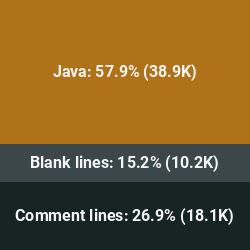

## What is Cyder

Funny you should ask this question, I'm asked it quite a lot and usually fail to give a comprehensive and elegant
answer. The best I can do is something along the lines of "Cyder is a multi-purpose, desktop manager, GUI tool." It is
written using a custom Java UI library which was built on top of lightweight Swing components. No modern GUI
dependencies such as Material or FXML were used and all Cyder components are closely related
to [java/awt/Component.java](https://developer.classpath.org/doc/java/awt/Component-source.html).

Some examples of what you can do with Cyder include:

* Downloading Audio from a YouTube video, playlist, uuid, or link
* Image transforms, markup, and painting
* Evaluating mathematical expressions as simple as 2 * 2 or as complex as sin(e^pi*cos(64^cos(e^-1)))
* Visualizing algorithm such as A*, Graham Scan, Game of Life
* Converting audio files between formats
* Playing local Audio with the ability to "dreamify it"
* Hashing inputs with a nice hashing widget
* Writing and saving notes
* Demonstrate how Perlin noise works in both 2D and 3D
* Converting between temperature formats
* Storing and running shortcuts
* Playing games such as hangman or tic tac toe

## Screenshots

<b>Cyder Console</b>

 

<b>Weather Widget</b>

 

<b>Music Widget</b>

 

https://user-images.githubusercontent.com/60986919/176815977-b50fb247-7ae8-4f6f-acc6-c4198502407c.mp4

<b>Paint Widget</b>

 

<b>Pathfinding Visualizer</b>

 

https://user-images.githubusercontent.com/60986919/160253262-8b10844a-6385-4328-ab84-961d05777526.mp4

<b>Game of Life Widget</b>

 

https://user-images.githubusercontent.com/60986919/161394292-cb7bf459-d405-4efc-8ea1-33a127036a69.mp4

## Usage and Setup

To get started with Cyder, first download your favorite Java IDE such as IntelliJ, NetBeans, Eclipse, etc. You'll then
want to make sure the IDE supports gradle operations. Next, clone Cyder via
`git clone https://github.com/NathanCheshire/Cyder.git`. Now load the project in your IDE and allow the gradle setup
task to run and the IDE to synchronize. Now you'll be able to run Cyder by a runtime configuration which invokes the
main method inside of `Cyder.java` which is located in the `genesis` package. Once started, Cyder should recognize there
are no users found and prompt for the creation of a user. Go ahead and create an account now.

For development purposes, you may want to add two props within a props file (you may create your own if you choose).
Within the chosen props file, set `debug_hash_name` to the value of your username and `debug_hash_password` to the value
of your password, hashed once using SHA256 (hint: you can hash your password inside of Cyder using the hashing widget).
Follow the ini key-value format or copy from `props.ini` if creating your own props file. You may name your props file
whatever you wish, just make sure you tell Cyder to load it by ensuring the filename starts with `prop` and is an `ini`
file located inside of the `props` directory. One last thing, make sure that you annotate these key props and any other
props whose values you do not want appearing in the log files with `@no_log`. This will prevent the logger from writing
the value to the log file when props are loaded at runtime.
