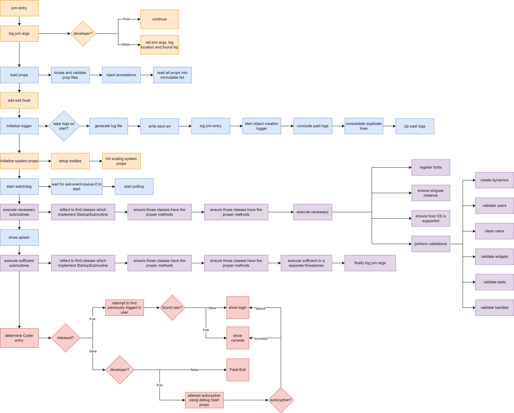

# Startup Architecture

by <b>Nathan Cheshire</b>

Last updated: 22-09-09

## Architecture

 

## Notes

- jvm args are stored but not logged until sufficient subroutines start (second purple path) The "log jvm entry" from
  the initialize logger path (blue) refers to the fact that any log file's first tag is always "JVM_ENTRY" along with
  the username of the OS' user
- the watchdog may be disabled via a prop
- the splash screen is shown as early as it can (I know it looks like it is rather late in the process)
- there are a few more branches for the `determine cyder entry` path (red), but they are not worth showing. All you need
  to know is that all branches (should) lead to an exit or showing the login screen as a failsafe if the console cannot
  be shown
